# Image-processing

## 📌 背景
隨著數位化與網路科技的快速發展，**數位影像** 在日常生活與專業領域中扮演越來越重要的角色，應用範疇涵蓋：  
- **無人機影像**（航拍、地理測繪、災害監測）  
- **行車紀錄器**（交通監控、事故分析）  
- **醫療影像**（診斷、手術輔助）  
- **版權保護**（數位媒體、攝影作品）  

然而，隨之而來的問題包括：  
- **影像篡改**（難以判斷真偽）  
- **隱私外洩**（敏感資訊可能被未授權取用）  
- **版權爭議**（影像來源與作者難以驗證）  

因此，如何在保留影像品質的同時，確保 **內容真實性、安全性與完整性**，成為亟待解決的重要課題。  

## 🎯 動機
隨著數位影像技術的快速發展，影像已成為現代生活與工作中不可或缺的一部分，廣泛應用於 **媒體、監控、醫療、交通** 等多個領域。  
然而，影像的真實性、完整性與隱私保護問題日益凸顯，特別是在 **無人機影像拍攝、行車紀錄、影像版權保護** 等場景中，如何確保影像內容不被篡改、數據安全儲存，成為一項重要挑戰。  

現有的數據隱藏技術雖然能夠將資訊嵌入影像，但在平衡 **影像視覺質量與數據容量** 方面仍有諸多限制。  
本研究針對以下問題提出解決方案：  
- 如何在不影響影像觀感的前提下，隱藏多種關鍵資訊（GPS、時間戳記、速度、數位簽章、影像哈希值）。  
- 如何確保這些資訊能夠準確提取並驗證影像完整性。  
- 如何結合 **隱藏技術 + 影像哈希值**，保障影像來源與版權。  

---

## 🛠 開發工具與程式語言
- **Visual Studio**  
- **C++**  
- **C#**  

---

## ⚙️ 功能
本研究開發一套整合 **影像處理與數據隱藏技術** 的系統，特色如下：  

- **數據隱藏與提取**
  - 採用 **LSB (Least Significant Bit)** 技術將資訊嵌入影像。  
  - 支援 GPS、時間戳記、行駛速度、數位簽章與影像哈希值的嵌入與提取。  

- **影像處理功能**
  - 負片轉換  
  - 模糊化  
  - 邊緣強化  
  - 銳化處理  
  - 雜訊生成  
  - 灰階轉換  
  - 增加對比度  
  - 直方圖均衡化  

- **安全性與版權保護**
  - 計算影像哈希值並嵌入，防範影像盜用。  
  - 嵌入文字訊息於圖片中並可準確提取。  
  - 確保影像來源與內容完整性。  

---

## 📊 成果展示

### 🔹 系統畫面
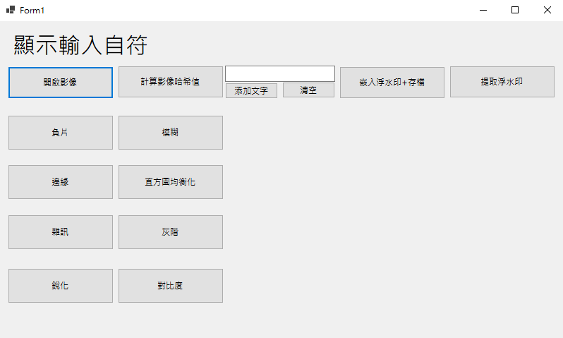

### 🔹 原始圖片
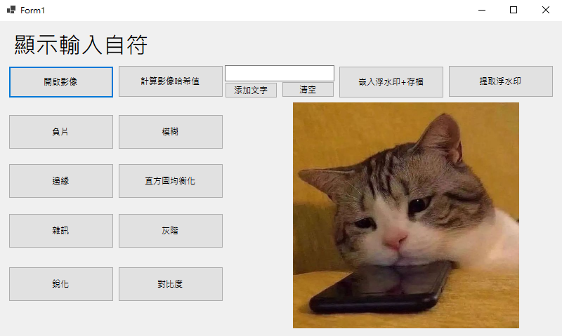

### 🔹 負片轉換
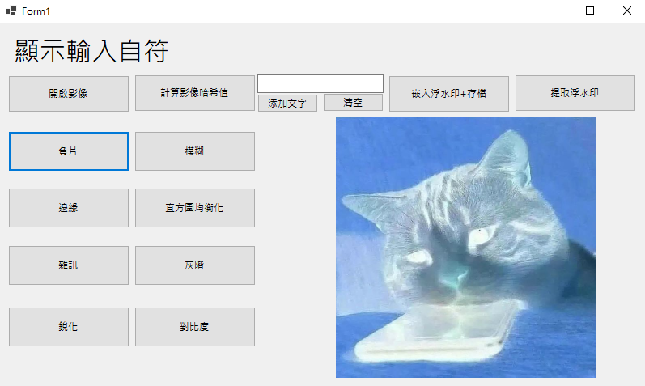

### 🔹 模糊化

### 🔹 邊緣強化
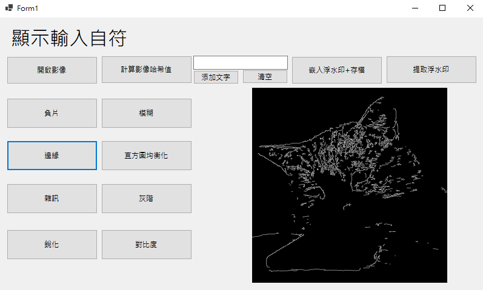

### 🔹 直方圖均衡化

### 🔹 雜訊生成
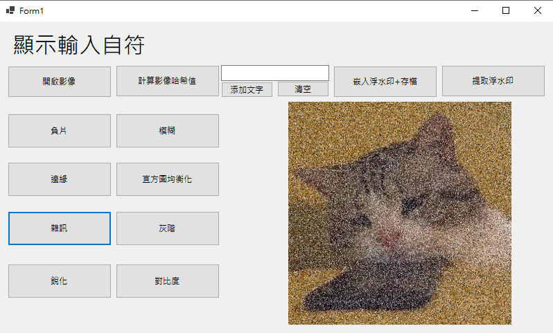

### 🔹 灰階轉換
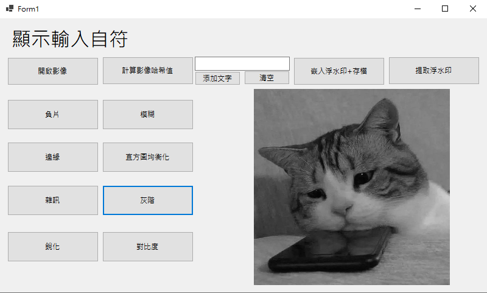

### 🔹 銳化處理
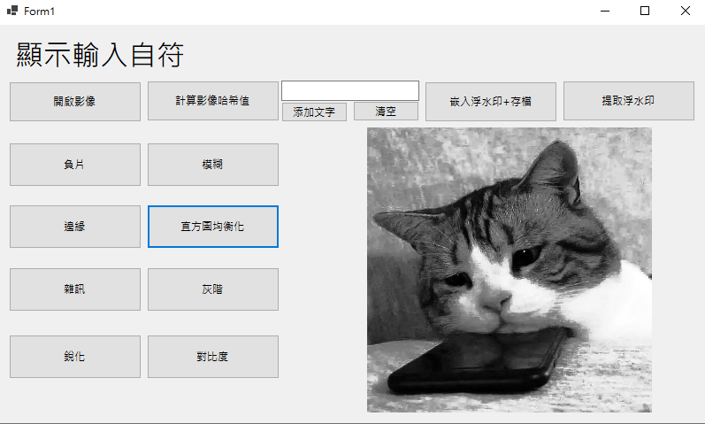

### 🔹 增加對比度
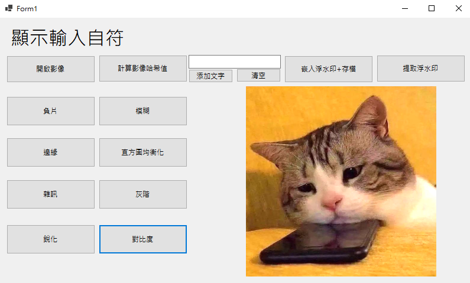

### 🔹 計算圖片哈希值
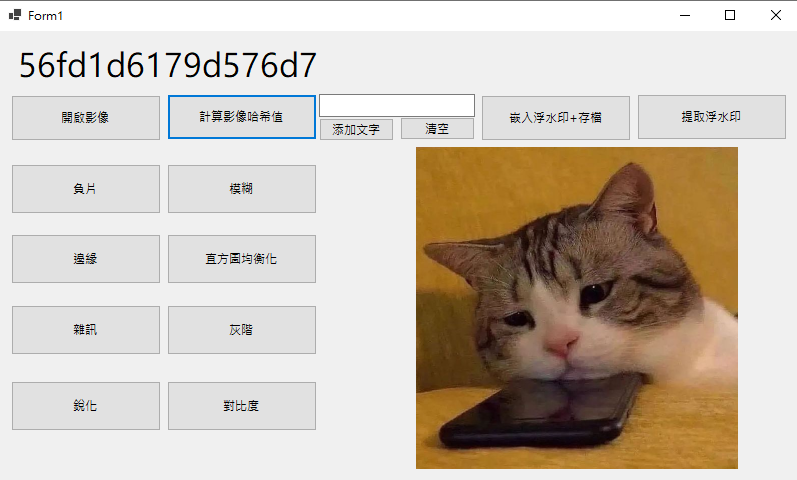

### 🔹 增加文字嵌入圖片
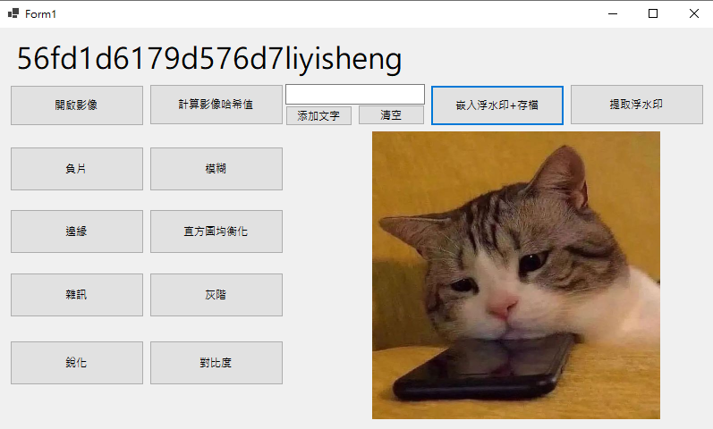

### 🔹 提取隱藏文字
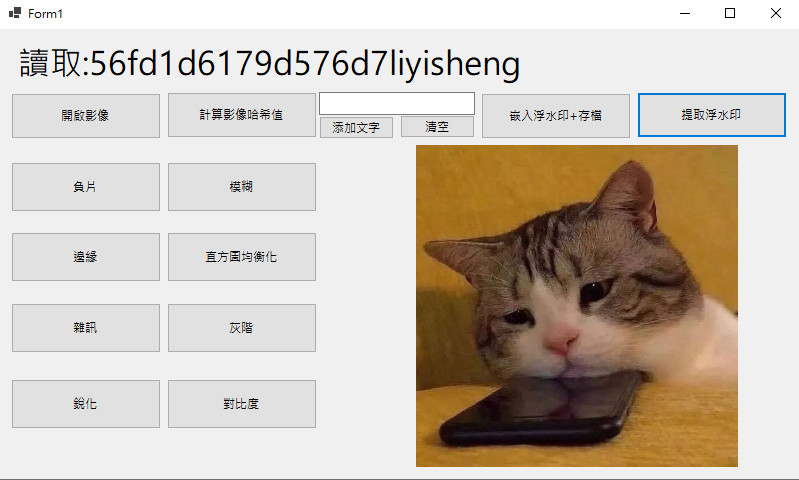

---

## ✅ 結論
本研究成功開發了一套整合 **影像處理與數據隱藏** 的多功能系統，達成以下成果：  
- 在不影響影像視覺品質的前提下，將 **GPS 定位、時間戳記、行駛速度、數位簽章、影像哈希值** 嵌入影像。  
- 採用 **LSB 技術**，並結合多種影像處理方法，提升影像適用性。  
- 實現了嵌入數據的 **安全提取能力**，確保資訊完整性。  
- 提供 **影像哈希計算與驗證功能**，可檢查圖片是否遭竄改。  
- 實現 **文字資訊的嵌入與提取功能**，可應用於隱密傳輸或版權標示。  

本系統可廣泛應用於：  
- **無人機影像記錄**  
- **行車紀錄器**  
- **影像版權保護**  

有效提升數位影像技術的附加價值與應用潛力。  
